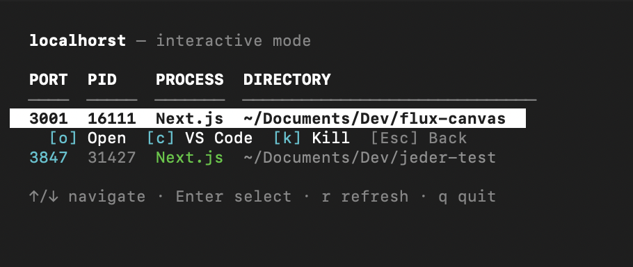

# localhorst

Zero-dependency CLI to list and kill local dev servers on ports 3000-9000.



## Install

### Homebrew (recommended)

```sh
brew tap ASchwad/localhorst
brew install localhorst
```

### From source (requires Bun)

```sh
bun install
bun link
```

## Usage

```sh
localhorst              # interactive TUI (default)
localhorst list         # non-interactive table output
localhorst kill 3000    # kill server on port 3000
localhorst kill --all   # kill all dev servers
localhorst kill 3000 -f # force kill (SIGKILL)
```

## Release

Push a version tag to trigger an automated release:

```sh
git tag v0.2.0
git push origin v0.2.0
```

This builds binaries for macOS (arm64/x64) and Linux (arm64/x64), creates a GitHub Release, and updates the Homebrew formula automatically.
